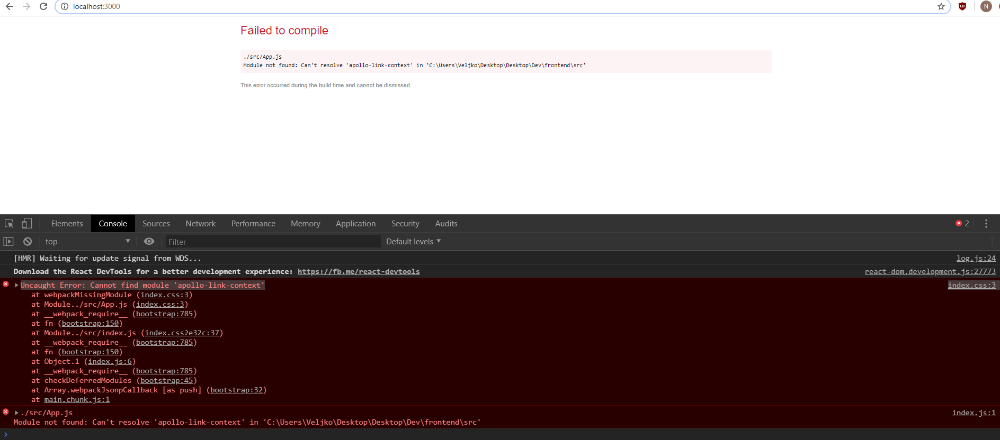

# 0x19. Postmortem

Any software system will eventually fail, and that failure can come stem from a wide range of possible factors: bugs, traffic spikes, security issues, hardware failures, natural disasters, human error… Failing is normal and failing is actually a great opportunity to learn and improve. Any great Software Engineer must learn from his/her mistakes to make sure that they won’t happen again. Failing is fine, but failing twice because of the same issue is not.

A postmortem is a tool widely used in the tech industry. After any outage, the team(s) in charge of the system will write a summary that has 2 main goals:

- To provide the rest of the company’s employees easy access to information detailing the cause of the outage. Often outages can have a huge impact on a company, so managers and executives have to understand what happened and how it will impact their work.

- And to ensure that the root cause(s) of the outage has been discovered and that measures are taken to make sure it will be fixed.

For this school project, I created an imaginary situation that didn't happen to any of the projects that I've contributed in. But it's a good example to help other developers and the ones starting their career in the Software Engineering field avoid some similar disastrous situation and to valorize the significance of Postmortem.

## My first postmortem

### CASE

I was developing an application a type of query with GraphQL and ReactJS using Apollo as a client, where some types of responses were tested by a Lambda AWS.

### Issue summary
On 24/05/2020 Starting from 9:35 PM PST until 10:42 AM PST, The entire application stopped working, the user interface did not allow any action, and they only showed code errors

# Apparent reason
A badly installed update of the apollo client was damaging the data query to be brought from the server to the client 

## Timeline
- This following events took place on sunday, May the 24th, 2020:

* 9:35 pm - The problem was detected because the application did not show any data in its interface, data that is loaded by GraphQL queries brought from the Lambda AWS
* 9:45 pm - First it was verified that the base code in the interface had not been altered in any of the Reactjs components
* 9:57 pm- Second, the integrity of the Lambda service was verified.
* 10:15 pm - Third-party test integrity of queries, APIs between client and server
* 10:40 pm - All the dependencies were reinstalled, one by one and we began to test the application in each one.
* 10.46 pm - In the end a dependency was not downloaded correctly and generated a runtime error for Apollo, which affected the integration of queries between client and server

## Root cause and Resolution
the interruption of the service was caused by a dependency called Apollo, which allows integrating the GraphQL and Lambda queries, the Apollo was in version 2.0 and happened to be installed in its most recent version 3.0, but the download had problems and generated the unit will be installed correctly.
Fortunately it was just a matter of reinstalling that dependency and normalizing the service

## Issue Image
