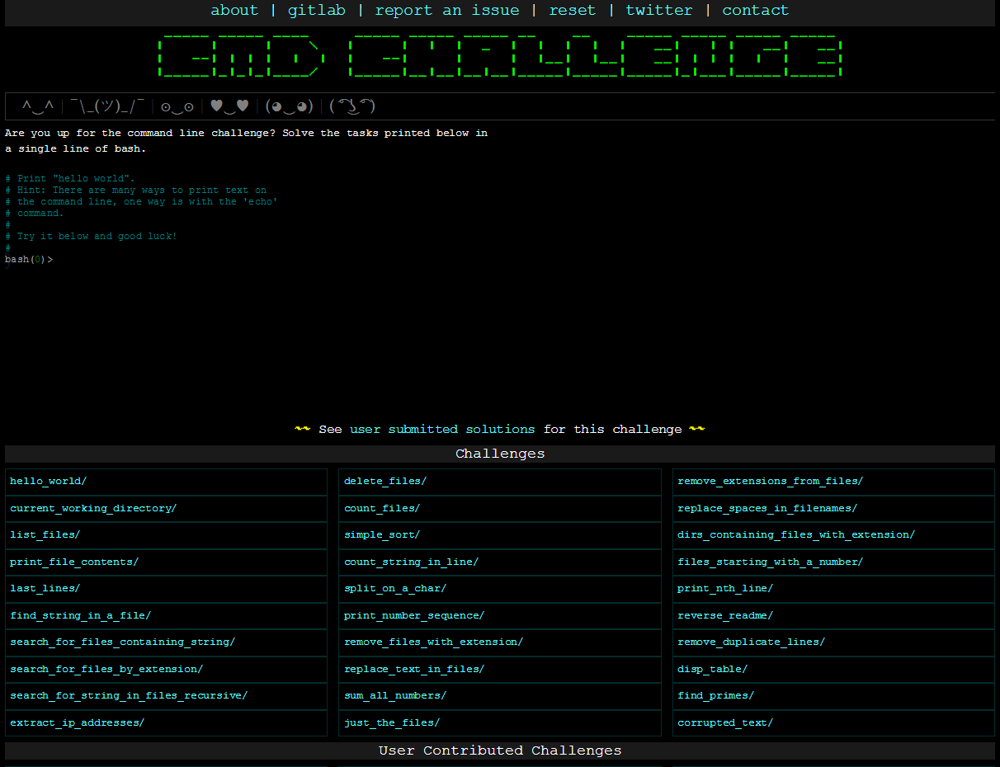

# Command line for the win

CMD CHALLENGE is a pretty cool game challenging you on Bash skills. Everything is done via the command line and the questions are becoming increasingly complicated. It’s a good training to improve your command line skills!

This project is NOT mandatory at all. It is 100% optional. Doing any part of this project will add a project grade of over 100% to your average. Your score won’t get hurt if you don’t do it, but if your current average is greater than your score on this project, your average might go down. Have fun!

- Official Web page: [cmdchallenge](https://cmdchallenge.com/)



## Requirements

### General

- A README.md file, at the root of the folder of the project, is mandatory
- This project will be manually reviewed.
- As each task is completed, the name of that task will turn green
- Create a screenshot, showing that you completed the required levels
- Push this screenshot with the right name to Github


# TASK

0. First 九 tasks #advanced

Complete the first 9 tasks.

File: 0-first_9_tasks


1. Reach חי completed tasks #advanced

Complete the 9 next tasks, getting to 18 total.

File: 1-next-9-tasks

- Task1: Hello_world

Print "Hello World".
hint_ there are many ways to print text on the command line, one way is with the 'echo' command
```
echo "Hello World"
```

- Task2: current_working_directory

Print the current working directory
```
pwd
```

- Task3: list_files

List names of all the files in the current directory, one file per line
```
ls
```


- Task4: print_file_content

There is a file named 'access.log' in the current directory, print the contents
```
cat access.log
```

- Task5: last_lines

Print the last 5 lines of 'access.log'
```
tail -n 5 access.log
```

- Task6: find_string_in_a_file

There is a file named 'access.log' in the current working directory. print all lines in this file that contains the string 'GET'
```
grep "GET" access.log
```

- Task6: search_for_files_containing_string

Print all files in the current directory, one per line (not the path, just the filename) that contain the strins '500'
```
grep -l "500" *
```

- Task7: search_for_files_by_extension

Print the relative file paths, one path per line for all filenames that start with 'access.log' in the current directory
```
find . -iname "access.log*"
```

- Task8: search_for_string_in_files_recursive

Print all matching lines (without the filename or the file path) in all files under the current directory that start with 'access.log' that contain the string "500", Note that there are no files named 'access.log' in the current directory, you will need to search recursively
```

```


2. Reach the perfect cube, 27 #advanced

Complete the 9 next tasks, getting to 27 total

File: 2-last-9-tasks
